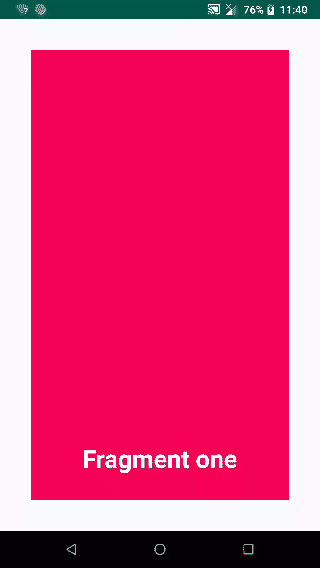
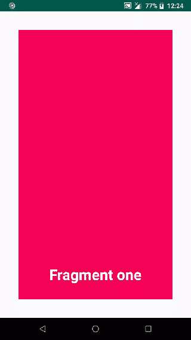

# ViewPagerTransformer
A simple Viewpager transformer library from where you can create beautiful page transitions.Easy to use

  
  
## How to ##
To get project into your build:

Step 1. Add the JitPack repository to your build file

Add it in your root build.gradle at the end of repositories:

	allprojects {
		repositories {
			...
			maven { url 'https://jitpack.io' }
		}
	}
Step 2. 
Add the dependency:
<pre><code>dependencies
 { 
    implementation 'com.github.PranavMalayil:ViewPageTransformer:1.0'
 }</code></pre>
 
 # Example #
 
 ## Kotlin ##
 
## Using default custom style ##

<pre><code>
  viewPager.adapter =
            ViewPagerAdapter(
                supportFragmentManager,
                FragmentStatePagerAdapter.BEHAVIOR_RESUME_ONLY_CURRENT_FRAGMENT
            )
        viewPager.setPageTransformer(
            true,
            PrsPageTransformer()
        )
</code></pre>

## Customizing default prebuilt styles ##
<pre><code>
viewPager.setPageTransformer(
            true,
            PrsPageTransformer(PageTransformStyles.TINDER_TOP_LEFT_TRANSFORMATION)
        )
</code></pre>

### And some styles ###

 
 CLOCK SPIN TRANSFORMATION             |  HORIZONTAL FLIP TRANSFORMATION |  FADE TRANSFORMATION
:-------------------------:|:-------------------------:|:-------------------------:
  |   |  

### Different styles ###

<table>
	<tr>
	<th>Style</th>
	<th>Description</th>
    </tr>
	<tr>
		<td>SIMPLE_TRANSFORMATION</td>
		<td>Default viewpager transformation</td>
	</tr>
		<tr>
		<td>CLOCK_SPIN_TRANSFORMATION</td>
		<td>Spins the page in clock wise direction</td>
	</tr>
		<tr>
		<td>CLOCK_SPIN_TRANSFORMATION_FADE_BOTH</td>
		<td>Spins the page and alos fade both of the pages</td>
	</tr>
		<tr>
		<td>CLOCK_SPIN_TRANSFORMATION__FADE_START</td>
		<td>Spins the pages but fades only the first page</td>
	</tr>
	<tr>
		<td>CLOCK_SPIN_TRANSFORMATION_FADE_END</td>
		<td>Spins the page in clock wise direction and also fades the senod page</td>
	</tr>
	<tr>
		<td>CLOCK_SPIN_TRANSFORMATION_FLY</td>
		<td>Spins the page in clock wise direction with fly out effect</td>
	</tr>
	<tr>
		<td>CLOCK_SPIN_TRANSFORMATION_FLY_FADE_END</td>
		<td>Spins the page in clock wises and fades the ending page with fly out effect</td>
	</tr>
  	<tr>
		<td>CLOCK_SPIN_TRANSFORMATION_FLY_FADE_BOTH</td>
		<td>Spins the page in clock wises and fades the both page with fly out effect</td>
	</tr>
  	<tr>
		<td>ANTI_CLOCK_SPIN_TRANSFORMATION</td>
		<td>Spins the page in anti-clock wise direction/td>
	</tr>
  	<tr>
		<td>ANTI_CLOCK_SPIN_TRANSFORMATION_FADE_BOTH</td>
		<td>Spins the page in anti-clock wise direction and also fade every pages</td>
	</tr>
  	<tr>
		<td>ANTI_CLOCK_SPIN_TRANSFORMATION_FADE_START</td>
		<td>Spins the page in anti-clock wise direction and also fade starting page</td>
	</tr>
  	<tr>
		<td>ANTI_CLOCK_SPIN_TRANSFORMATION_FADE_END</td>
		<td>Spins the page in anti-clock wise direction and fade the secong page</td>
	</tr>
  	<tr>
		<td>ANTI_CLOCK_SPIN_TRANSFORMATION_FLY</td>
		<td>Spins the page in ant-clock wise direction and also make a fly out effect</td>
	</tr>
  	<tr>
		<td>ANTI_CLOCK_SPIN_TRANSFORMATION_FLY_FADE_BOTH</td>
		<td>Spins the page in ant-clock wise direction and also make a fly out effect together with every page fadeing animation</td>
	</tr>
  	<tr>
		<td>ANTI_CLOCK_SPIN_TRANSFORMATION_FLY_FADE_START</td>
		<td>Spins the page in ant-clock wise direction and also make a fly out effect together with starting page fadeing animation</td>
	</tr>
  	<tr>
		<td>ANTI_CLOCK_SPIN_TRANSFORMATION_FLY_FADE_END</td>
		<td>Spins the page in ant-clock wise direction and also make a fly out effect together with ending page fadeing animation</td>
	</tr>
  	<tr>
		<td>HORIZONTAL_FLIP_TRANSFORMATION</td>
		<td>Flips every page in horizontal direction</td>
	</tr>
  	<tr>
		<td>HORIZONTAL_FLIP_TRANSFORMATION_FADE_BOTH</td>
		<td>Flips every page in horizontal direction together with fade animation</td>
	</tr>
  	<tr>
		<td>HORIZONTAL_FLIP_TRANSFORMATION_FADE_START</td>
		<td>Flips every page in horizontal direction together with fade animation in starting page</td>
	</tr>
  	<tr>
		<td>HORIZONTAL_FLIP_TRANSFORMATION_FADE_END</td>
		<td>Flips every page in horizontal direction together with fade animation in edning page</td>
	</tr>
  	<tr>
		<td>VERTICAL_FLIP_TRANSFORMATION</td>
		<td>Flips every page in vertical direction</td>
	</tr>
  	<tr>
		<td>VERTICAL_FLIP_TRANSFORMATION_FADE_BOTH</td>
		<td>>Flips every page in vertical direction together with fade animation</td>
	</tr>
  	<tr>
		<td>VERTICAL_FLIP_TRANSFORMATION_FADE_START</td>
		<td>Flips every page in vertical direction together with fade animation in starting page</td>
	</tr>
  	<tr>
		<td>VERTICAL_FLIP_TRANSFORMATION_FADE_END</td>
		<td>Flips every page in vertical direction together with fade animation in ending page</td>
	</tr>
  	<tr>
		<td>DEPTH_TRANSFORMATION</td>
		<td>Depth transformatiom in every page</td>
	</tr>
  	<tr>
		<td>DEPTH_TRANSFORMATION_FADE_BOTH</td>
		<td>Depth transformatiom in every page together with fade animation</td>
	</tr>
  	<tr>
		<td>DEPTH_TRANSFORMATION_FADE_START</td>
		<td>Depth transformatiom in every page together with fade animation in starting page</td>
	</tr>
  	<tr>
		<td>DEPTH_TRANSFORMATION_FADE_END</td>
		<td>Depth transformatiom in every page together with fade animation in ending page</td>
	</tr>
  	<tr>
		<td>DEPTH_TRANSFORMATION_SCALE_BOTH</td>
		<td>Depth transformatiom in every page together with scaling animation while moving from one page to another</td>
	</tr>
  	<tr>
		<td>DEPTH_TRANSFORMATION_SCALE_BOTH_FADE_START</td>
		<td>Depth transformatiom in every page together with scaling animation while moving from one page to another and fading at starting page</td>
	</tr>
  	<tr>
		<td>DEPTH_TRANSFORMATION_SCALE_BOTH_FADE_END</td>
		<td>Depth transformatiom in every page together with scaling animation while moving from one page to another and fading at ending page</td>
	</tr>
  	<tr>
		<td>DEPTH_TRANSFORMATION_SCALE_END</td>
		<td>Depth transformatiom in every page together with scaling animation on ending page while moving from one page to another and fading at ending page</td>
	</tr>
  	<tr>
		<td>POP_TRANSFORMATION</td>
		<td>Pop up animation while selecting page</td>
	</tr>
  	<tr>
		<td>POP_TRANSFORMATION_FADE_BOTH</td>
		<td>Pop up animation together with fading</td>
	</tr>
  	<tr>
		<td>POP_TRANSFORMATION_FADE_START</td>
		<td>Pop up animation together with fading only in starting page</td>
	</tr>
  	<tr>
		<td>POP_TRANSFORMATION_FADE_END</td>
		<td>Pop up animation together with fading only in second pages</td>
	</tr>
  	<tr>
		<td>POP_TRANSFORMATION_SCALE_START</td>
		<td>Pop up animation together with scale animation at starting page</td>
	</tr>
  <tr>
		<td>POP_TRANSFORMATION_SCALE_END</td>
		<td>Pop up animation together with scale animation at ending page</td>
	</tr>
  <tr>
		<td>POP_TRANSFORMATION_SCALE_BOTH</td>
		<td>Pop up animation together with scale animation</td>
	</tr>
  <tr>
		<td>POP_TRANSFORMATION_SCALE_BOTH_FADE_START</td>
		<td>Pop up animation together with scale animation and also fade animation at even pages</td>
	</tr>
  <tr>
		<td>POP_TRANSFORMATION_SCALE_BOTH_FADE_END</td>
		<td>Pop up animation together with scale animation and also fade animation at odd pages</td>
	</tr>
  <tr>
		<td>CUBE_OUT_TRANSFORMATION</td>
		<td>Cube animation while changing pages</td>
	</tr>
  <tr>
		<td>CUBE_OUT_TRANSFORMATION_FADE_BOTH</td>
		<td>Cube animation together with fading in every page</td>
	</tr>
  
  
</table>

